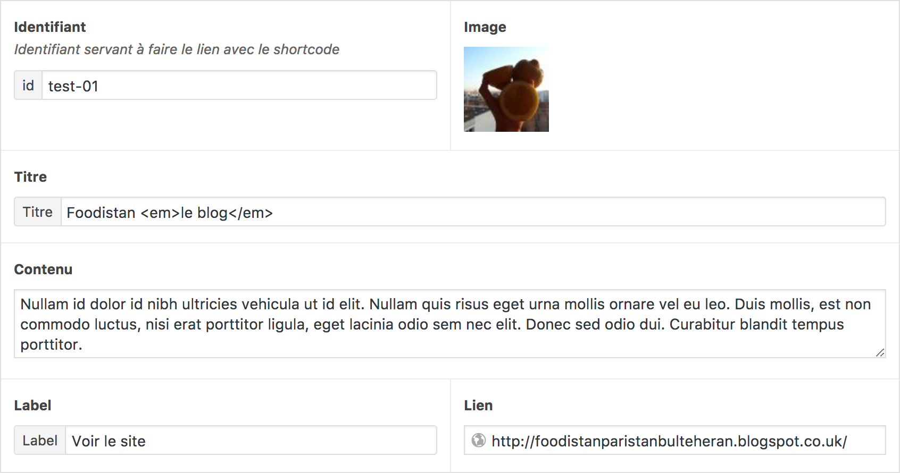

# Shortcodes

The theme comes with two shortcodes `image_content` and `rich_content`. The theme also uses and customises the `gallery` built in shortcode from WordPress but with much improvement, very much.

## `image_content`

When you hover a link, an image appears, it's the purpose of this shortcode.

`image_content` is a self closing shortcode coming with two parameters `content` and `url`.

### `content`

The content of `image_content` shortcode. It can be HTML.

### `url`

The url of the image.

### How to use it

```
[image_content content="Some content" url="http://some-url.com"]
```

## `rich_content`

With the help of the [ACF plugin](https://www.advancedcustomfields.com/), `rich_content` allows us to enrich the content.  
It comes with one parameter wich is an `id`.

### `id`

### How to use it

```
[rich_content id="some_id"]Some content[/rich_content]
```

Then fill the __ACF__ field. You must put the same _id_ to link them.


